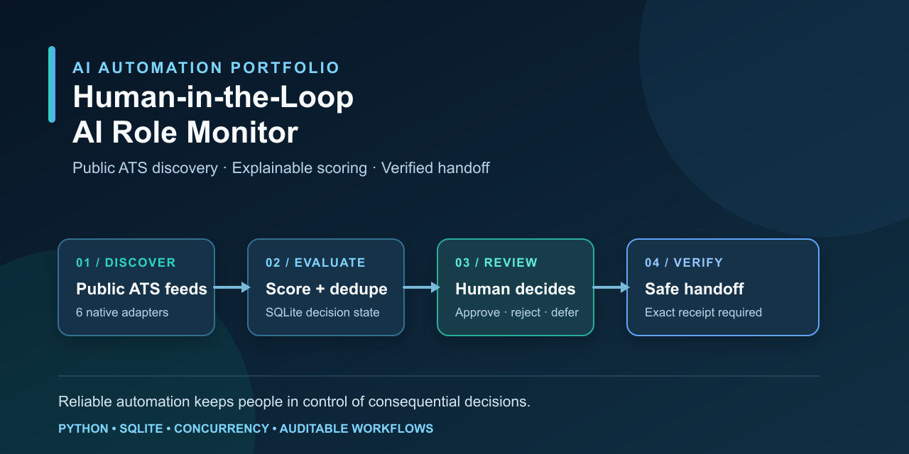
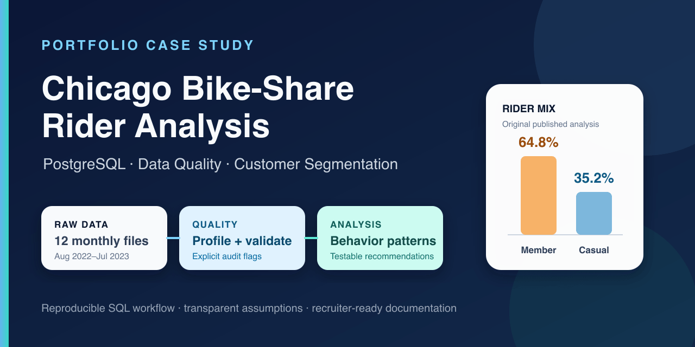

# Mark Cruz — AI Automation & Implementation

I build reliable automation systems that connect APIs, structured data, durable state, human review, and verified handoffs. My focus is implementation work that is observable, testable, and safe to operate—not hands-off black boxes.

Based in the Philippines and open to remote roles in **AI automation, implementation, workflow engineering, and technical solutions delivery**. Connect with me on [LinkedIn](https://www.linkedin.com/in/markcastillocruz/).

## What I build

- Workflow automation and API integrations with explicit failure handling.
- Human-in-the-loop systems with auditable state and approval boundaries.
- Python, SQLite, PostgreSQL, and SQL data workflows with reproducible checks.
- Credential-safe demos, automated tests, and documented operational limits.

## Featured projects

### [Human-in-the-Loop AI Role Monitor](https://github.com/mccruz/human-in-the-loop-ai-role-monitor)

A Python automation project that converts public job listings into a human-reviewed, auditable handoff queue for AI and workflow roles.

- Integrates six documented public ATS feeds with concurrent discovery, bounded retries, and per-source failure isolation.
- Uses configuration-driven scoring, stable role identity, SQLite decision state, and explicit approve/reject/defer review.
- Produces deterministic handoff manifests with exact receipt verification, redacted reports, and an optional summary-only Telegram digest.
- Includes a fully offline synthetic demo and automated tests; it monitors opportunities but never submits applications.

[Explore the repository](https://github.com/mccruz/human-in-the-loop-ai-role-monitor) · [Review the architecture](https://github.com/mccruz/human-in-the-loop-ai-role-monitor/blob/main/docs/architecture.md) · [See release v1.1.0](https://github.com/mccruz/human-in-the-loop-ai-role-monitor/releases/tag/v1.1.0)

### [Chicago Bike-Share Rider Analysis](https://github.com/mccruz/case_study_divvy)

A reproducible PostgreSQL case study that turns a one-file exploratory analysis into a staged data-quality and customer-segmentation workflow.

- Separates source profiling, preparation, analysis, and post-build validation into an auditable SQL pipeline.
- Corrects cross-midnight ride duration and makes duplicate, endpoint, and operational-station rules explicit.
- Preserves historical findings as historical claims and translates observed rider patterns into testable marketing ideas.
- Documents assumptions, limitations, reproduction steps, and dataset rights; raw trip data is not redistributed.

[Explore the repository](https://github.com/mccruz/case_study_divvy) · [Read the methodology](https://github.com/mccruz/case_study_divvy/blob/main/docs/methodology.md) · [Open the Tableau story](https://public.tableau.com/app/profile/mark.cruz4539/viz/CaseStudyDivvy/Story1)

## How I work

- Make assumptions, decisions, failure states, and evidence visible.
- Default to public or synthetic data and keep credentials out of source control.
- Verify outcomes with tests, validation checks, or exact delivery receipts.
- Keep people in control of consequential decisions.
- Document how to reproduce a result and where the system's limits begin.

## Current direction

I am seeking remote AI automation and implementation roles where reliable integrations, operational workflows, clear documentation, and collaboration with nontechnical stakeholders matter.

## Connect

[LinkedIn — Mark Cruz](https://www.linkedin.com/in/markcastillocruz/)
