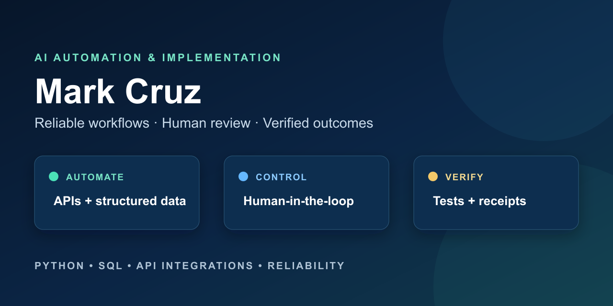

# Mark Cruz — AI Automation & Implementation

I build reliable automation systems that connect APIs, structured data, human
review, and verified delivery. My work focuses on clear behavior, safe failure
handling, and documentation that technical and nontechnical teams can follow.

I am open to remote roles in AI automation, implementation, workflow
engineering, and technical solutions delivery. Connect with me on
[LinkedIn](https://www.linkedin.com/in/markcastillocruz/).

## Selected projects

Each project can be reviewed directly on GitHub. Local setup is optional.

### [n8n Job Monitor](https://github.com/mccruz/n8n-job-monitor)

Collects job listings from approved feeds, applies explainable matching rules,
prevents duplicate records, verifies saved results, and reports confirmed
outcomes to Slack. Applications and career decisions remain human-controlled.

[Overview](https://github.com/mccruz/n8n-job-monitor#review-this-project-in-3-minutes) ·
[Architecture](https://github.com/mccruz/n8n-job-monitor/blob/main/docs/architecture.md) ·
[Offline demo](https://github.com/mccruz/n8n-job-monitor/blob/main/docs/demo-guide.md)

### [Reddit Community Insights](https://github.com/mccruz/reddit-community-insights-n8n)

Runs separate n8n workflows for two Reddit communities, reviews posts,
supported images, and sampled comments, then sends a structured Slack digest
for each community. Untrusted Reddit content is summarized inside a restricted
service with validated output.

[Overview](https://github.com/mccruz/reddit-community-insights-n8n) ·
[Architecture](https://github.com/mccruz/reddit-community-insights-n8n/blob/main/docs/architecture.md) ·
[Security](https://github.com/mccruz/reddit-community-insights-n8n/blob/main/SECURITY.md)

### [Social Commerce Video Automation](https://github.com/mccruz/social-commerce-video-automation)

Ranks fictional product candidates with visible rules, builds a supported
script and storyboard, and prepares a human-reviewed content handoff. Paid
generation and publishing remain disabled in the public demo.

[Overview](https://github.com/mccruz/social-commerce-video-automation) ·
[Architecture](https://github.com/mccruz/social-commerce-video-automation/blob/main/docs/architecture.md) ·
[Offline demo](https://github.com/mccruz/social-commerce-video-automation/blob/main/docs/demo-guide.md)

### [Human-in-the-Loop AI Role Monitor](https://github.com/mccruz/human-in-the-loop-ai-role-monitor)

Collects roles from documented public job feeds, scores them with visible
rules, preserves review decisions, and requires a person to approve every
handoff. It monitors opportunities but never submits applications.

[Overview](https://github.com/mccruz/human-in-the-loop-ai-role-monitor) ·
[Architecture](https://github.com/mccruz/human-in-the-loop-ai-role-monitor/blob/main/docs/architecture.md) ·
[Security](https://github.com/mccruz/human-in-the-loop-ai-role-monitor/blob/main/SECURITY.md)

### [Reliable AI Agent Ops](https://github.com/mccruz/reliable-ai-agent-ops)

Demonstrates how to check service health, create and verify backups, test a
restore in isolation, and stop for human review before recovery. The included
scenario uses fictional data and no production credentials.

[Overview](https://github.com/mccruz/reliable-ai-agent-ops) ·
[Architecture](https://github.com/mccruz/reliable-ai-agent-ops/blob/main/docs/architecture.md) ·
[Automated checks](https://github.com/mccruz/reliable-ai-agent-ops/actions/workflows/ci.yml)

### [Trade Execution Safety Lab](https://github.com/mccruz/trade-execution-safety-lab)

Tests how order automation handles partial fills, cancellations, interruptions,
duplicate submissions, and inconsistent provider data. The default demo is
offline and contains no trading strategy or live-trading path.

[Overview](https://github.com/mccruz/trade-execution-safety-lab) ·
[Failure scenarios](https://github.com/mccruz/trade-execution-safety-lab/blob/main/docs/scenarios.md) ·
[Latest release](https://github.com/mccruz/trade-execution-safety-lab/releases/latest)

### [Chicago Bike-Share Rider Analysis](https://github.com/mccruz/case_study_divvy)

Uses a staged PostgreSQL workflow and Tableau story to examine data quality,
compare member and casual rider behavior, and turn historical patterns into
testable marketing ideas.

[Overview](https://github.com/mccruz/case_study_divvy) ·
[Methodology](https://github.com/mccruz/case_study_divvy/blob/main/docs/methodology.md) ·
[Tableau story](https://public.tableau.com/app/profile/mark.cruz4539/viz/CaseStudyDivvy/Story1)

## What I bring

- Workflow automation and API integrations with visible failure handling.
- AI-assisted processes that preserve source evidence and human responsibility.
- Python, JavaScript, SQL, n8n, Docker, and structured data workflows.
- Automated checks, credential-safe public demos, and clearly stated limits.

## Connect

[LinkedIn — Mark Cruz](https://www.linkedin.com/in/markcastillocruz/)
